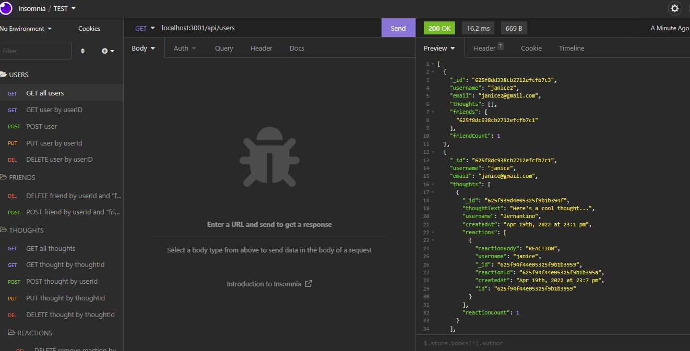

# Thoughter

### Description
This MongoDB back-end web application utilizes a date library, Express.js, and Mongoose packages. A walkthrough video is provided to view functionality through Insomnia. A user is allowed to have friends, post thoughts, post reactions to thoughts, and more through CRUD operations.
### License

This application is licensed under MIT

### Application Demo Image

### Table of Contents
- [Description](#description)
- [Contributing](#contributing)
- [Tests](#tests)
- [Questions?](#questions)

### Contributing
No contributions at this time.

### Tests
N/A

### Questions
GitHub Username: (kcaseychamberlain) 

View the project in GitHub at: https://github.com/KCaseyChamberlain/thoughter

Walthrough video: https://drive.google.com/file/d/1KF1hDD-CrUKKRdFKl_3-XilJ9Ns0w68M/view

If you have any questions, contact Casey at: caseygchamberlain@gmail.com